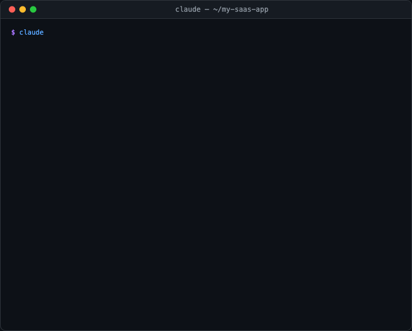

[English](README.md) | [繁體中文](README.zh-TW.md) | [日本語](README.ja.md) | [简体中文](README.zh-CN.md) | [Español](README.es.md) | [한국어](README.ko.md)

# 🎯 The Product Playbook

**World-class product planning AI Skill — from idea to development, one framework to rule them all**

[](https://www.npmjs.com/package/product-playbook)
[](https://opensource.org/licenses/MIT)
[](https://code.claude.com)
[](https://claude.ai)
[](http://makeapullrequest.com)
[](README.md)

> Integrates the most impactful PM frameworks from Lenny's Podcast (Teresa Torres, Shreyas Doshi, Gibson Biddle, April Dunford, Todd Jackson, Marty Cagan, Richard Rumelt, and more) — turning AI into your senior product manager coach.

---

## ✨ What Is This?

The Product Playbook is a **Claude AI Skill** that systematically guides you through end-to-end product planning, from zero to one. It is not just a prompt — it is a complete interactive framework guidance system that includes:

- 🧭 **6 execution modes** — from 30-minute rapid validation to full-blown product plans (including a feature expansion fast track)
- 📐 **22 product frameworks** — covering the entire Discovery → Define → Develop → Deliver pipeline
- 🤝 **3 specialist sub-agents** — Discovery, Strategy Critique, and Pre-mortem run as isolated context windows with framework-specific expertise
- 🔄 **Change propagation engine** — modify any step and all downstream outputs update automatically
- 📎 **Smart file integration** — upload data, screenshots, or documents; the AI automatically integrates them into the relevant step
- 🔗 **Dev handoff** — generates CLAUDE.md + TASKS.md + TICKETS.md for seamless handoff to Claude Code development
- 📊 **Multi-format output** — PDF (with bookmarks), HTML reports, Word docs, PowerPoint decks, dev handoff packages
- 📄 **Smart document import** — three-layer PDF parsing (text extraction → Claude Vision → OCR fallback), DOCX/PPTX support

**Trigger the entire flow with a single sentence:**

```
I want to build a product
```

---

## 🎬 Demo

<p align="center">
  
</p>

> The demo above shows **Build Mode**: describe your requirements → scan codebase → detect tech stack → apply frameworks for problem clarification, then jump straight into solution design.

---

## 🚀 Quick Start

### Option 1: Claude.ai Custom Skill

> ⚠️ Don't use GitHub's "Download ZIP" — the repo is ~70MB (demo GIFs) and Claude.ai's Custom Skills uploader caps at 30MB.

1. Download `product-playbook-claude-ai-v<latest>.zip` (~900KB) from the [latest release](https://github.com/kaminoikari/product-playbook/releases/latest)
2. Unzip it locally
3. Go to [Claude.ai](https://claude.ai) → Settings → Custom Skills
4. Upload the `product-playbook/` folder from the unzipped contents
4. Say "I want to build a product" in a conversation to trigger the skill

### Option 2: Claude Code Plugin

In Claude Code, run:

```
/plugin marketplace add kaminoikari/product-playbook
/plugin install product-playbook@kaminoikari-product-playbook
```

> The first command adds the marketplace (one-time setup). The second installs the plugin.

### Option 3: Claude Code Skill (Recommended)

> 💡 To update: simply re-run the install command to overwrite with the latest version.

| Method | Best for | Requirements |
|--------|----------|-------------|
| ① Copy & Paste | Beginners | Just open Claude Code |
| ② One-line install | Developers | Terminal |
| ③ Manual install | Custom paths | Terminal + git |

#### ① Copy & Paste Install (Easiest)

After launching Claude Code, paste the following and Claude will handle the installation automatically:

```
Please run the following commands to install (or update) product-playbook skill,
and tell me the result when done:

git clone https://github.com/kaminoikari/product-playbook.git /tmp/product-playbook
mkdir -p ~/.claude/skills ~/.claude/commands
cp -r /tmp/product-playbook ~/.claude/skills/product-playbook
cp /tmp/product-playbook/commands/* ~/.claude/commands/
rm -rf /tmp/product-playbook
```

#### ② One-line Install (Terminal)

```bash
# curl
curl -fsSL https://raw.githubusercontent.com/kaminoikari/product-playbook/main/install.sh | bash

# npx (requires Node.js)
npx product-playbook
```

Uninstall:

```bash
curl -fsSL https://raw.githubusercontent.com/kaminoikari/product-playbook/main/install.sh | bash -s -- --uninstall
# or
npx product-playbook --uninstall
```

#### ③ Manual Install

```bash
git clone https://github.com/kaminoikari/product-playbook.git
mkdir -p ~/.claude/skills ~/.claude/commands
cp -r product-playbook ~/.claude/skills/product-playbook
cp product-playbook/commands/* ~/.claude/commands/
```

Once installed, trigger in Claude Code:

```bash
# Main skill command
> /product-playbook

# Slash Commands (available after install)
> /product-quick I want to build an expense tracking app
> /product-full a pet social platform
> /product-revision redesign our e-commerce checkout flow

# Or natural language
> I want to plan a product
> Analyze my product using JTBD
> Help me plan an MVP
```

---

## 📦 File Structure

```
product-playbook/
├── SKILL.md                          # Core engine: mode definitions, step sequences, command system
├── LICENSE                           # MIT License
├── README.md                         # English README (this file)
├── README.zh-TW.md                   # Traditional Chinese README
├── assets/
│   └── demo.gif                      # README demo animation
├── commands/                         # Claude Code CLI Slash Commands (optional install)
│   ├── product-quick.md              # /product-quick — Quick mode
│   ├── product-full.md               # /product-full — Full mode
│   ├── product-revision.md           # /product-revision — Revision mode
│   ├── product-build.md              # /product-build — Build mode
│   ├── product-feature.md            # /product-feature — Feature Extension mode
│   ├── product-prd.md                # /product-prd — Generate PRD
│   ├── product-report.md             # /product-report — Generate HTML report
│   └── product-dev.md                # /product-dev — Generate dev handoff package
├── agents/                           # Specialist sub-agents (auto-loaded by Claude Code plugin)
│   ├── discovery-specialist.md       # Persona / JTBD / OST / Journey Map specialist
│   ├── strategy-critic.md            # Rumelt-lens strategy critic
│   └── pre-mortem-runner.md          # 15+ failure scenarios + leading indicators
└── references/
    ├── 00-opportunity-check.md       # Opportunity assessment + DHM Model
    ├── 01-strategy.md                # Strategy Blocks + Rumelt + OKR
    ├── 02-discovery.md               # Persona + JTBD + OST + Journey Map
    ├── 03-define.md                  # Pain points + Positioning + HMW + Opportunity assessment
    ├── 04-develop.md                 # PR-FAQ + Pre-mortem + RICE + MVP + PRD
    ├── 05-deliver.md                 # North Star + PMF + GTM + Business model + Product spec
    ├── 06-html-report.md             # HTML planning report output spec
    ├── 07-dev-handoff.md             # Dev handoff: CLAUDE.md + TASKS.md + Architecture
    ├── 08-security-checklist.md      # OWASP Top 10 + CORS + CSP + Security architecture
    ├── rules-context.md              # Cross-session product context accumulation rules
    ├── rules-document-tools.md       # Document conversion tool dependency management
    ├── rules-import-document.md      # Three-layer PDF parsing + DOCX/PPTX import
    ├── rules-export-document.md      # Multi-format export (PDF/DOCX/PPTX)
    ├── rules-*.md                    # Mode step rules + progress/change/file integration rules
    └── templates/
        ├── prd-style.css             # Professional print-grade CSS for PDF export
        └── report-style.css          # Print optimization CSS for HTML report → PDF
```

---

## 🧭 Six Execution Modes

| Mode | Steps | Duration | Best for |
|------|-------|----------|----------|
| 🚀 **Quick Mode** | 3 steps | ~30 min | Rapid idea validation, pitch prep |
| 📦 **Full Mode** | 9–11 steps (8 Core + 1 Default-ON Journey Map + 2 Default-OFF Optionals) | 1-2 hours | New product planning, major revamps |
| 🔄 **Revision Mode** | 6–8 steps (6 Core + 2 Optional) | <1 hour | Iterating on existing products |
| ✏️ **Custom Mode** | 4-16 steps | Varies | Filling specific gaps |
| ⚡ **Build Mode** | 7 steps | ~1 hour | Problem is known, jump to solutions |
| 🔧 **Feature Expansion** | 4 steps | ~30 min | Adding a single feature to an existing product |

---

## 📐 Frameworks Included

### Understanding Users
| Framework | Creator | Purpose |
|-----------|---------|---------|
| JTBD (Jobs to Be Done) | Clayton Christensen | Uncover the real job users are trying to get done |
| Persona | — | Task/motivation-driven user archetypes |
| User Journey Map | — | End-to-end user experience mapping |
| Continuous Discovery | Teresa Torres | Weekly habit of talking to users |
| OST (Opportunity Solution Tree) | Teresa Torres | Systematically connect opportunities to solutions |

### Defining the Problem
| Framework | Creator | Purpose |
|-----------|---------|---------|
| Positioning | April Dunford | Competitive context and differentiation |
| HMW (How Might We) | — | Transform pain points into design challenges |

### Solution Design
| Framework | Creator | Purpose |
|-----------|---------|---------|
| Working Backwards / PR-FAQ | Amazon | Start from the customer outcome and work backwards |
| Pre-mortem | Shreyas Doshi | Predict and prevent failure before it happens |
| GEM Model | Gibson Biddle | Growth / Engagement / Monetization prioritization |
| RICE Scoring | Intercom | Quantitative feature prioritization |
| MVP Definition | — | Minimum viable product scoping |

### Strategy
| Framework | Creator | Purpose |
|-----------|---------|---------|
| Strategy Blocks | Chandra Janakiraman | Mission → Vision → Strategy hierarchy |
| Good Strategy Kernel | Richard Rumelt | Diagnosis → Guiding policy → Coherent action |
| DHM Model | Gibson Biddle | Delight / Hard to copy / Margin-enhancing |
| Empowered Teams | Marty Cagan | Empowered teams vs. feature teams |

### Measurement & Delivery
| Framework | Creator | Purpose |
|-----------|---------|---------|
| North Star Metric | Sean Ellis / Amplitude | Single metric representing core user value |
| Four-level PMF Framework | Todd Jackson | Assessing product-market fit |
| Sean Ellis Score | Sean Ellis | Quantifying PMF enthusiasm |
| GTM Strategy | — | Go-to-market launch and acquisition |
| Business Model & Pricing | — | Revenue model selection and value-based pricing |

---

## 🔑 Key Features

### 📎 Smart File Integration

Upload supplementary files at any step — the AI automatically identifies and integrates them:

| Upload | Auto-integrated into |
|--------|---------------------|
| Competitor screenshots | Positioning analysis |
| Interview transcripts | Persona + JTBD |
| User data CSV | Opportunity assessment + PMF evaluation |
| Market report PDF | Opportunity assessment + Strategy |
| Existing PRD | Revision mode + MVP |

### 🔄 Change Propagation Engine

Modify any upstream step and downstream outputs update automatically:

```
Modify JTBD → auto-updates HMW, Positioning, PR-FAQ, North Star, Product Spec Summary
Modify MVP  → auto-updates User Stories, DB Schema, Product Spec Summary
```

### 🔗 Dev Handoff

Generate a complete dev handoff package and kick off Claude Code development with a single command:

```
📦 Dev Handoff Package
├── CLAUDE.md          → Claude Code project memory
├── TASKS.md           → Feature breakdown + phased delivery
├── TICKETS.md         → Ticket list (ready for Jira/Asana/Linear)
├── docs/
│   ├── PRD.md         → Full PRD
│   ├── ARCHITECTURE.md → DB Schema + API + directory structure
│   └── PRODUCT-SPEC.md → Product spec summary
└── scripts/
    └── setup.sh       → One-click initialization script
```

```bash
# Start development in Claude Code with a single command
> Please read CLAUDE.md and TASKS.md, start executing Phase 0
```

### 🪝 Lifecycle Hooks

Three plugin hooks turn the playbook's core rules from "Claude needs to remember" into harness-enforced behavior. All hooks emit advisory `systemMessage` reminders — none of them block the user.

| Event | Trigger | What it does |
|-------|---------|--------------|
| `SessionStart` | Every new / resumed session | Auto-injects `.product-playbook-progress.md` and `.product-context.md` into the model's context so a planning session resumes from the exact step it was paused at. |
| `UserPromptSubmit` | Each user prompt during an active planning session | Detects (a) off-topic prompts (debug / error / "fix this code") and reminds Claude to follow the off-topic save-progress rule, and (b) change-intent keywords (`改 step 2`, `update persona`, `重做 JTBD`) and reminds Claude to apply the Change Propagation rules. |
| `PreToolUse` (Write/Edit/MultiEdit) | Each file-write attempt | If the project is still in planning mode (no `.product-dev-active` marker) and the target is a source-code file (`.ts/.tsx/.py/.go/...`), reminds Claude that planning produces docs, not code. The marker is auto-created when `/product-dev` runs. |

Hooks are auto-loaded from `hooks/hooks.json` when the plugin is installed. They no-op outside playbook projects, so installing the plugin has zero effect on unrelated codebases.

### 📄 Document Import & Export

**Import** any existing document into the planning flow — no manual copy-paste:

```
PDF (digital)   → pymupdf text extraction (instant, free)
PDF (vector/scan) → Claude Vision semantic parsing (best quality)
PDF (fallback)  → Tesseract OCR (offline capable)
DOCX / PPTX     → Pandoc conversion
```

**Export** planning outputs to professional formats:

```
/export pdf   → Playwright rendering + pikepdf bookmarks (CJK-perfect)
/export docx  → Pandoc + reference template
/export pptx  → Pandoc slide generation
/export html  → Interactive HTML report (existing)
```

> **Why PDF via Playwright?** WeasyPrint produces garbled CJK text. Playwright (Chromium) renders perfectly — verified in production with Traditional Chinese documents.

### 🔥 Plan Directly on Existing Systems (Build Mode Killer Feature)

Launch **Build Mode** inside an existing project directory — Claude Code reads your codebase while doing product planning, effectively merging **product planning** and **technical feasibility assessment** into a single flow:

```
Your Existing Project                 Product Playbook
┌─────────────────┐                ┌─────────────────────┐
│ src/             │  ← auto-scan → │ Pre-mortem risk      │
│ db/schema.sql    │  ← auto-scan → │ MVP scoping          │
│ api/routes/      │  ← auto-scan → │ RICE prioritization  │
│ package.json     │  ← auto-scan → │ User Story breakdown │
│ CLAUDE.md        │  ← auto-scan → │ Dev handoff (delta)  │
└─────────────────┘                └─────────────────────┘
```

**Usage example:**

```bash
# 1. Navigate to your existing project
cd /path/to/your-existing-project

# 2. Launch Claude Code
claude

# 3. Use Build Mode and describe the feature you want to add
> /product-feature I want to add real-time notifications to my existing system
```

Claude Code will automatically:
- Scan your directory structure, tech stack, and DB schema
- Run Pre-mortem based on your **real architecture** (not hypothetical risks)
- Generate MVP and User Stories that plug directly into existing modules
- Produce a dev handoff package as an **incremental plan**, not a greenfield build

> 💡 **Why is this powerful?** Traditional product planning and technical assessment are separate processes — PMs write specs, toss them to engineers, and engineers say "this can't be done." Build Mode grounds the planning process in real system constraints, eliminating the back-and-forth.

### 🔒 Security Built In

Dev handoff packages automatically include security architecture — no afterthought patching:

- **OWASP Top 10 checklist** — input validation, authentication/authorization, XSS/CSRF protection
- **Security architecture section** — CORS policies, CSP headers, rate limiting, API security middleware
- **.gitignore template** — auto-excludes `.env`, credentials, progress files
- **Pre-mortem security scenarios** — data breaches, account takeovers, API abuse as mandatory considerations

### 📦 Cross-Session Product Context Accumulation

Planning outputs are automatically saved to `.product-context.md` and loaded on the next session:

```
1st session (Full Mode) → saves Identity + Core Strategy + Architecture
2nd session (Feature Expansion) → auto-loads tech stack and modules, skipping redundant collection
3rd session (Revision Mode) → carries forward historical decisions and known pain points, focusing on deltas
```

### 🏢 Automatic B2B / B2C Adaptation

Once the product type is confirmed, frameworks auto-adapt:

| Aspect | B2C | B2B |
|--------|-----|-----|
| Persona | Individual motivation segmentation | Buyer + User dual Persona |
| PMF | DAU / Retention / Sean Ellis | Paying customers / NRR / NPS |
| North Star | Core action completion count | ARR / Net Revenue Retention |
| Aha Moment | Within first use | Onboarding / Time-to-Value |

---

## 📊 Quality Benchmark Results

By comparing response quality between "with Skill guidance" and "without Skill guidance" using automated AI grading, we quantify the real impact of the Skill.

### Four Iterations Compared

| Iteration | Test Items | With Skill Pass Rate | Without Skill Pass Rate | Delta |
|-----------|:--------:|:-------------------:|:----------------------:|:-----:|
| Iteration 1 (Baseline) | 6 | 100% | 57.4% | +42.6% |
| Iteration 2 | 6 | 100% | 63.3% | +36.7% |
| Iteration 3 | 6 | 94.1% | 38.2% | +55.9% |
| **Iteration 4 (Latest)** | **9** | **100%** | **31%** | **+69% ✅** |

### Iteration 4 Detailed Results (9 tests × 49 expectations)

| Test Item | With Skill | Without Skill | Delta |
|-----------|:--------:|:------------:|:-----:|
| Mode Selection (3-step progressive) | 100% | 0% | +100% |
| Quick Mode JTBD Analysis | 100% | 43% | +57% |
| JTBD Depth (B2B org-level) | 100% | 57% | +43% |
| PR-FAQ Writing | 100% | 33% | +67% |
| Revision Mode | 100% | 67% | +33% |
| Quality Self-check Hard Gate | 100% | 0% | +100% |
| **Feature Expansion Mode (New)** | **100%** | **17%** | **+83%** |
| **Security Integration (New)** | **100%** | **25%** | **+75%** |
| **Context Bootstrap (New)** | **100%** | **0%** | **+100%** |

### Key Findings

- **Quality Self-check Hard Gate** (+100%): Whether the AI proactively critiques its own output with strict standards, flags gaps, and demands improvement after completing a deliverable — 0% pass rate without the Skill
- **Context Bootstrap** (+100%): Whether the AI collects foundational product information before starting to plan, rather than jumping straight into technical implementation — completely skipped without the Skill
- **Feature Expansion Mode** (+83%): Whether the AI recognizes "adding a feature to an existing product" scenarios and activates a streamlined 4-step flow instead of the full 6-11 steps — without the Skill, it jumps straight to technical solutions
- **Security Integration** (+75%): Whether the dev handoff includes security architecture, .gitignore templates, and platform-specific security measures — without the Skill, security is reduced to a single summary table

> See [`evals/`](./evals/) for detailed methodology and data.

### Iteration 5: Sub-agent A/B Comparison (3 dispatch-relevant evals × 22 expectations)

A focused A/B run measuring the marginal quality contribution of the 3 specialist sub-agents (`discovery-specialist`, `strategy-critic`, `pre-mortem-runner`) shipped in v1.2.0+. Same skill version (v1.2.3), same prompts, two arms:

- **WITH sub-agent**: executor reads the specialist's `agents/*.md` file and follows its declared output schema + self-checks; dispatch is marked in the response.
- **WITHOUT sub-agent**: executor is forbidden from reading any `agents/*.md` or mentioning delegation; must handle the step inline as the orchestrator using only `SKILL.md` + `commands/` + `references/`.

| Eval | With Sub-agent | Without Sub-agent | Delta |
|-----------|:--------:|:------------:|:-----:|
| Discovery (Persona + JTBD) | 100% (7/7) | 85.7% (6/7) | +14.3% |
| Strategy Critic | 100% (6/6) | 83.3% (5/6) | +16.7% |
| **Pre-mortem (Build Mode risk)** | **100% (9/9)** | **22.2% (2/9)** | **+77.8% ✅** |
| **TOTAL** | **100% (22/22)** | **59.1% (13/22)** | **+40.9%** |

Token cost is essentially identical across arms (151K vs 154K) — keeping a specialist costs no more than handling the step inline.

**Key Findings**

- **Pre-mortem-runner is load-bearing** (+77.8%): without it the orchestrator produces a thin, future-tense risk list and misses scenario count (≥15), 5-category coverage, leading-indicator discipline, cheap pre-launch experiments, and past-tense "shipped-and-failed" framing. The structured specialist schema is doing real work that `references/` alone does not reproduce.
- **Discovery-specialist and strategy-critic are modest contributors** (+14–17%): the orchestrator can produce reasonable Persona+JTBD analyses and strategy critiques inline. The diverging assertion in each case is the dispatch contract itself, not the structural quality.
- **Implication**: of the 3 specialists, the pre-mortem-runner gives the largest standalone quality lift and is the most justified by these results. The other two could in principle be folded back into the orchestrator with stronger reference pages, though there is no cost incentive to do so (tokens are a wash).

**Harness caveat**: the `general-purpose` executor used in this eval harness does not expose nested `Task` dispatch, so the WITH arm approximates real dispatch by reading the specialist's `agents/*.md` and following its schema inline (with an explicit dispatch marker). The structural contrast vs WITHOUT is real, but a true top-session run would be needed to verify end-to-end Task-tool dispatch quality.

> Raw artifacts and per-assertion divergence in [`~/product-playbook-workspace/iteration-3/benchmark.md`](./evals/).

### Iteration 6: Token Optimization Pass (v1.2.5)

A token-reduction iteration. Same skill content semantics, smaller footprint per session. Goal: ≥25% token reduction while holding quality at 100%.

**Changes shipped:**
- **SKILL.md slim** — extracted Sub-Agent Delegation Rules to lazy `rules-subagent-dispatch.md`; tightened Hard Gate descriptions; consolidated Mode Overview duplication. **6,188 → 2,877 tokens (-54%)** for the eager entry point.
- **rules-context.md split** — kept decision logic eager (1,594 tokens); moved verbose YAML templates + Bootstrap procedure + Conflict UX scripts to lazy `rules-context-template.md` (1,849 tokens, loaded only on trigger).
- **rules-quality-review.md slim** — distilled from 1,040 → 817 tokens with compact 3-step protocol + 1-line per-framework checklists.
- **Specialist agents slim** — removed embedded framework knowledge that duplicated `references/*.md`, replaced with on-demand pointers. **discovery-specialist −25%, strategy-critic −18%, pre-mortem-runner −20%** per dispatch.

**Estimated savings per 9-step Full Mode session:**

| Source | Before | After | Saved |
|--------|:------:|:-----:|:-----:|
| Eager (SKILL + context + progress) | ~8,800 | ~5,500 | **−3,300** |
| Quality review (×9 step loads) | ~9,360 | ~7,353 | **−2,007** |
| Sub-agent dispatches (3 specialists) | ~9,005 | ~7,106 | **−1,899** |
| **Total per session** | **~27,200** | **~18,900** | **−8,300 (−30%)** |

**Quality validation:** pre-mortem-runner (the most quality-sensitive specialist per Iteration 5) re-ran eval-12 on v1.2.5 slimmed content. Result: **9/9 assertions PASS** — 16 scenarios across all 5 categories, 5 architecture-grounded scenarios citing real stack components, 5 cheap pre-launch experiments with binary decision rules, past-tense framing maintained. Static cross-check confirmed eval-10/11 assertions (13 total) all have explicit support in the slim agent prompts.

**Token cost trade-off:** the split adds 2 new lazy files (`rules-subagent-dispatch.md` 978 tokens, `rules-context-template.md` 1,849 tokens) that load only when triggered. In the most common session paths, they never load. In Bootstrap-or-Conflict paths, the eager savings still net positive.

**Mirrored to 5 i18n locales** (zh-TW, zh-CN, ja, es, ko) preserving existing translations — structural slim applied identically per language.

### Iteration 7: Eval Harness Resilience (Sprint 1 + 2A, v1.2.9)

A harness-level iteration, not a skill-level one. No skill semantics changed; the *surface area being measured* did. Goal: surface the real quality baseline by unblocking 4 evals that had been silently producing 0/0 verdicts.

**Sprint 1 — unblock unmeasurable clusters (`d2023fb`, `cee67cb`):**

Four evals (`eval-jtbd-depth`, `eval-prfaq-output`, `eval-subagent-discovery`, `eval-subagent-premortem`) had been producing 0 passes / 0 fails per run — indistinguishable from "no problems" in the aggregate score. Three causes:

1. **Sub-agents missing in headless CI** — CI installed the skill at `~/.claude/skills/` but never copied `agents/*.md` to `~/.claude/agents/`. `claude -p` therefore couldn't dispatch via `Task`, and the orchestrator silently inline-ran.
2. **Specialist-dispatch hook silent under `claude -p`** — plugin-level `hooks/` are not loaded in headless mode; only user-level `~/.claude/settings.json` UserPromptSubmit hooks are. CI now programmatically registers the dispatch hook at the user level before each behavioral run.
3. **Response + judge timeouts too aggressive** — 180s response / 120s judge cut off long-form Discovery and Pre-mortem outputs mid-thought; the judge then saw a truncated string and emitted 0/0. Bumped to 600s / 240s with a single retry on non-JSON output.

Also dropped procedural "orchestrator delegates via Task tool" expectations from evals 10/11/12 — those are unverifiable in `claude -p` (no nested Task surface) and not the property we ultimately care about. The remaining expectations target the *output quality* the specialist would have produced.

**Sprint 2A — judge robustness + CI ceiling (`f973939`):**

Two follow-on fixes from PR #9 code review:

1. **Judge repair retry preserves original context** — `claude -p` is stateless, so the repair prompt now re-includes the full original `judge_prompt` (response + expectations) plus the previous malformed output. A new `_judge_output_complete()` check rejects payloads that don't have exactly N indexed expectations, preventing the model from emitting a plausibly-shaped but fabricated verdict when the first call's output is unrecoverable.
2. **CI `behavioral-eval` job timeout 90 → 120 min** — worst case = 12 evals / 2 workers × (600s response + 240s judge + 240s repair) ≈ 108 min, so the previous 90-min ceiling could silently cancel an otherwise valid run. 120 min leaves ~10 min headroom for setup + artifact upload.

**Newly visible baseline** (local run, 2026-05-28): **0 / 100** `at-risk`, **13 / 33** expectations passing, **6 critical + 14 warning** failures. The aggregate score did not regress — what regressed is the *visible* score, because four evals that previously contributed 0/0 now produce real signal. The 6 critical failures are now the explicit Stage 2 backlog: 3-layer JTBD (functional / emotional / social), B2B organization-level Jobs, B2B buyer-vs-user persona separation, Discovery-scope guardrails, and pre-mortem leading-indicator discipline. See [`docs/sprint1-local-eval-2026-05-28.md`](./docs/sprint1-local-eval-2026-05-28.md) for the per-expectation breakdown.

**Harness improvements live in `evals/` and `.github/workflows/` — they do not ship to npm.** No version bump beyond v1.2.9 (which carried the user-level hook + scope edits to evals 10/11/12).

**Mirrored to 5 i18n locales** (zh-TW, zh-CN, ja, es, ko).

### Iteration 8: Closed-Loop Self-Correction Pipeline (v1.2.14)

Stage 1 (Sprint 1) made failures *visible*. Stage 2 (manual) confirmed the pattern: critical / warning failures could be flipped by adding **Hard Gate blocks** (rule + FAIL examples + ✅ examples) to the relevant reference file, then mirroring to 5 i18n. Iteration 8 automates that loop end-to-end and ships the result.

**The pipeline that now exists** (each step is a script under `scripts/` exposed as an `npm run` entrypoint):

```
[manual eval run]
       ↓
eval-results.behavioral.json
       ↓
scripts/eval-debt-report.py        ← failure → file attribution (no LLM)
       ↓ per-file fix backlog
scripts/patch-proposer.py          ← LLM proposes Hard Gate diff (dry-run default)
       ↓ EN diff for human review
references/*.md updated by hand-applied diff
       ↓
scripts/i18n-mirror-apply.py       ← LLM propagates EN change to 5 langs (dry-run default)
       ↓ 5-language diffs
i18n/*/references/*.md updated by --apply
       ↓
scripts/i18n-drift-report.py       ← deterministic detector (no LLM) verifies sync
       ↓ exit 0 = clean
[manual eval re-run]
       ↓
scripts/eval-lift-report.py        ← per-expectation delta + score-vs-real-lift attribution
```

Two LLM-using tools (`patch-proposer`, `i18n-mirror-apply`) are dry-run by default with `--max N` blast-radius caps and `--apply` gates so the human stays in the loop on every write.

**CI policy** changed in tandem: `eval-gate.yml` is now `workflow_dispatch` only (the 2026-05-28 incident where auto-run on PR + push silently exhausted the maintainer's 5-hour subscription quota during Stage 2.3 smoke testing was the trigger). A new lightweight `i18n-drift-check.yml` *does* auto-fire on PR / push touching `references/` or `i18n/` because the detector is deterministic Python with no API calls — notification-only, never blocks merge.

**Numbers from the post-closed-loop local run** (2026-05-29, `--runs 1`, full 12-eval suite, score artifact at [`docs/post-closed-loop-eval-2026-05-29.md`](./docs/post-closed-loop-eval-2026-05-29.md), lift attribution at [`docs/eval-lift-closed-loop.md`](./docs/eval-lift-closed-loop.md)):

| Run | Coverage | Expectations Passing | Critical Failures | Warning Failures | Aggregate Score |
|---|---|---|---|---|---|
| Sprint 1 baseline (2026-05-28) | 4 evals (partial) | 13 / 33 (39 %) | 6 | 14 | 0 / `at-risk` |
| **Post-closed-loop (2026-05-29)** | **12 evals (full)** | **69 / 82 (84 %)** | **5** | **6** | **0 / `at-risk`** |

Aggregate score is capped at 0 in both runs (cumulative severity deductions exceed the 100-point budget), but the underlying movement is dramatic. On the **4 evals shared with the Sprint 1 baseline** (apples-to-apples, 31 paired expectations):

- **17 improved** (fail → pass), including 4 of the Stage 2 critical backlog: 3-layer JTBD, B2B buyer-vs-user separation, Discovery-scope guardrails, B2B organization-level Jobs
- **2 regressed** — both on `eval-subagent-premortem` category coverage; LLM variance on `--runs 1` that `--runs 3` majority vote is expected to wash out
- **Net hard lift: +95 points** (gain +125, loss −30)

The 8 evals added to coverage (51 new expectations) close the visibility gap; only `eval-mode-selection`, `eval-security-awareness`, `eval-context-bootstrap`, and `eval-subagent-premortem` still hold the 5 remaining critical failures. Those are the next round's `patch-proposer` targets.

**Mirrored to 5 i18n locales.**

---

## 🧪 Development & Evals

The `evals/` directory ships two complementary test suites and a deterministic scorer.

**Local (free, recommended):** run the same scripts with the `claude` CLI authenticated via your Claude Pro/Max subscription (`claude login` once). No API key, no marginal cost. The eval system is designed to be run locally before each release.

**CI (manual trigger only, no extra billing):** `.github/workflows/eval-gate.yml` runs both suites on `workflow_dispatch` — Actions UI → "Eval Report" → "Run workflow", or `gh workflow run eval-gate.yml --ref <branch>`. Auto-trigger on PR / push was removed in Iteration 8 because each run consumes a 5-hour-rolling slice of subscription quota (see the 2026-05-28 incident in the Iteration 8 notes). It **never blocks merge or publish** — the maintainer decides whether to act on regressions. CI runs on your Claude Pro/Max subscription (no API key, no per-token cost): one-time setup is `claude setup-token` locally, then add the printed token as repo secret `CLAUDE_CODE_OAUTH_TOKEN`. Without the secret, eval jobs **skip cleanly** (gray ⏭️) instead of failing red.

A separate lightweight workflow, `.github/workflows/i18n-drift-check.yml`, *does* auto-fire on every PR / push touching `references/` or `i18n/` because the underlying detector is deterministic Python with no API calls. It posts a Job Summary on every run and a PR comment only when critical drift is present. Notification-only, never blocks merge.

### Running locally

```bash
# Recommended: one command runs both suites
npm run eval

# Or run pieces individually
npm run eval:trigger      # ~5–15 min — checks if the skill auto-triggers
npm run eval:behavioral   # ~10–40 min — uses claude as assistant AND judge
npm run eval:zh-TW        # behavioral eval against the zh-TW eval set
npm run eval:quick        # 1 run only, no majority vote (fast iteration)
npm run eval:test         # unit tests for the scoring module

# Drop into the underlying Python scripts when you need finer control:
python3 evals/run_behavioral_eval.py --only 11        # debug a single eval id
python3 evals/run_behavioral_eval.py --fail-on none   # report without exit 1
python3 evals/run_trigger_test.py --eval-file evals/trigger-eval-fuzzy.json
```

Local runs default to `--runs 3` (majority vote handles LLM variance); the `claude` CLI uses your Claude Pro/Max OAuth session (`claude login`), so there's no per-token cost. CI uses `--runs 1` and the same subscription via a `CLAUDE_CODE_OAUTH_TOKEN` secret (generated once with `claude setup-token`).

### Severity & scoring

Every expectation in `evals.json` is tagged with one of three severities:

| Severity | Deduction per failure | Used for |
|---|---|---|
| `critical` | −15 | Hard Gate violations, mode-dispatch errors, B2B buyer/user separation, security defaults, framework-level integrity (JTBD three layers, Rumelt diagnosis, pre-mortem 15+ scenarios) |
| `warning`  | −5  | Quality depth and structure (most expectations) |
| `info`     | −1  | Language detection, progress-indicator formatting |

Score starts at 100, deducts per failure, clamps to 0–100.

| Band | Range | Meaning |
|---|---|---|
| 🟢 `healthy` | ≥ 90 | At most one critical failure |
| 🟡 `needs-attention` | ≥ 70 | Up to two criticals or several warnings |
| 🔴 `at-risk` | < 70 | Three or more criticals; gate should fail |

### `--fail-on` semantics

| Flag value | Runner exits non-zero when… |
|---|---|
| `critical` | any critical expectation failed (CI default) |
| `any` | any expectation failed at any severity |
| `none` | never; informational mode for local exploration |

A single source of truth — `evals/compute_eval_score.py` — implements all scoring so the two runners cannot drift apart.

### Release checklist

Before bumping the version in `package.json` (a push to `main` with a changed `package.json` triggers `npm publish`):

1. `npm run eval` — get current trigger + behavioral scores
2. If any **critical** expectation fails, investigate and fix before publishing
3. If only warnings or info regressed, it's a judgment call — note your reasoning in the commit if you accept the regression
4. Commit any fixes, bump the version, then `git push`

---

## 💬 Available Commands

### ⌨️ Claude Code CLI Slash Commands

The main command available after installing the Skill:

| Command | Description |
|---------|-------------|
| `/product-playbook` | Launch the full product planning guided flow |

For more granular shortcuts, install the pre-built slash commands from the `commands/` folder:

```bash
# Install all slash commands
cp -r product-playbook/commands/* ~/.claude/commands/
```

| Command | Description |
|---------|-------------|
| `/product-quick <description>` | Quick Mode — run through JTBD → PR-FAQ → North Star in under 30 min |
| `/product-full <description>` | Full Mode — comprehensive plan (9–11 steps; Journey Map default ON) |
| `/product-revision <description>` | Revision Mode — iterate and optimize an existing product |
| `/product-build <description>` | Build Mode — skip Discovery, jump straight to solutions |
| `/product-feature <description>` | Feature Extension — add a single feature to an existing product (4 steps) |
| `/product-prd` | Generate PRD engineering handoff package |
| `/product-report` | Generate HTML planning report |
| `/product-dev` | Generate dev handoff package (CLAUDE.md + TASKS.md + TICKETS.md) |

### 💬 Natural Language Commands in Conversation

#### Flow Control
- `Switch to [framework]` — immediately switch frameworks
- `Skip this step` — skip the current step
- `Go back to [step name]` — return to any step to modify it
- `Simplify this` / `Expand on this` — adjust depth

#### Output Commands
- `Generate report` — HTML planning report
- `Generate PRD` — engineering handoff (includes flowcharts + DB Schema + wireframes)
- `Generate deck` — PowerPoint presentation
- `Start development` — dev handoff package (CLAUDE.md + TASKS.md)
- `/export pdf` — export as PDF with professional typography, cover page, TOC, and bookmarks
- `/export docx` — export as Word document
- `/export pptx` — export as PowerPoint slides
- `/parse [file]` — parse a PDF/DOCX/PPTX into Markdown for planning use

#### Analysis Commands
- `Run a completeness check` — assess planning coverage
- `Identify assumptions` — list unvalidated assumptions
- `Run a Pre-mortem` — pre-mortem analysis
- `What PMF level is this product at?` — PMF assessment
- `Find the bottleneck` — Aha Moment obstacle analysis

---

## 🤝 Contributing

Contributions are welcome! Here are some areas where help is especially appreciated:

- 🌍 **Multi-language support** — translate frameworks into other languages
- 📐 **New frameworks** — add more product management frameworks
- 📝 **Examples** — add more worked examples to each framework
- 🐛 **Bug reports** — logic issues or gaps found during use
- 💡 **UX improvements** — suggestions for interaction flow and command design

### How to Contribute

1. Fork this repo
2. Create your feature branch (`git checkout -b feature/amazing-framework`)
3. Commit your changes (`git commit -m 'feat: add amazing framework'`)
4. Push to the branch (`git push origin feature/amazing-framework`)
5. Open a Pull Request

### Contribution Guidelines

- Framework content in reference files must cite sources
- New frameworks must include updates to SKILL.md's framework index and step sequences
- Quality self-check lists use ✅ / ❌ format
- Multi-language support: maintain both English and Traditional Chinese versions

---

## 📚 Framework Sources & Further Reading

The frameworks in this project are synthesized from the public work of these thought leaders:

| Thought Leader | Core Contribution | Recommended Reading |
|----------------|-------------------|---------------------|
| Teresa Torres | Continuous Discovery, OST | *Continuous Discovery Habits* |
| Shreyas Doshi | LNO, Pre-mortem, Three Levels of Product Work | Lenny's Podcast Ep.3 |
| Gibson Biddle | DHM Model, GEM | Lenny's Podcast |
| April Dunford | Positioning Framework | *Obviously Awesome* |
| Todd Jackson | Four-level PMF, Four P's | Lenny's Podcast |
| Richard Rumelt | Good Strategy / Bad Strategy | *Good Strategy Bad Strategy* |
| Marty Cagan | Empowered Teams | *Inspired*, *Empowered* |
| Clayton Christensen | Jobs to Be Done | *Competing Against Luck* |
| Amazon | Working Backwards / PR-FAQ | *Working Backwards* |
| Sean Ellis | Sean Ellis Score, Growth | *Hacking Growth* |
| Lenny Rachitsky | Shape / Ship / Synchronize | Lenny's Newsletter + Podcast |

---

## 📄 License

This project is licensed under the [MIT License](LICENSE) — free to use, modify, and distribute without restriction.

---

## ⭐ Star History

If this project helps you, give it a ⭐ so more people can find it!

[](https://star-history.com/#kaminoikari/product-playbook&Date)

---

<p align="center">
  <strong>Built with ❤️ for Product Managers who want to build things that matter.</strong>
</p>

---

Copyright (c) 2026 Charles Chen.
